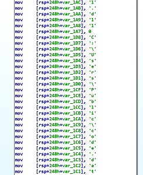

# PIShellcode - Position-Independent Shellcode Loader

# What is it?

PIShellcode is a Position-Independent shellcode loader. It's basically a C Program compiled as a PIC. It's a modified version of Mr mattifestation's PIC_BindShell project. Here are the details on how to write optimized shellcode for Windwos in C and Visual Studio which he greatly explains. http://www.exploit-monday.com/2013/08/writing-optimized-windows-shellcode-in-c.html

# Usage & support

The program currently uses a static XOR key `0x32 0x47 0x68 0x84 0x59 0x91 0x34 0x17 0x58 0x13 0x77 0x69 0x09 0x11 0x19 0x94` and static shellcode file from location `C:\Users\Public\code.dat`. Both can be changed in the code. Only `64 bit` architecture is supported.

# Problems & To-Dos
For whatever reason compiling & linking the code in Visual Studio 2017 with fully optimized arguments `/O1`, The generated code ends up having data segment register offsets to `.rdata` section in it. So in order to actualy obtain position independent code, Maximum optimization feature in compiler settings is turned off.

Look-into: merging two sections into one.

#### Maximum Optimized Command Line: `/GS- /TC /GL /W4 /Zc:inline /Fa"x64\Release\" /nologo /Zl /Fo"x64\Release\" /FA /Os /diagnostics:column` -> generates data segment offsets to `.rdata`

#### Custom Optimized Command Line: `/GS- /TC /GL /W4 /O1 /Zc:inline /Fa"x64\Release\" /nologo /Zl /Fo"x64\Release\" /FA /Os /diagnostics:column` -> generates PIC.

